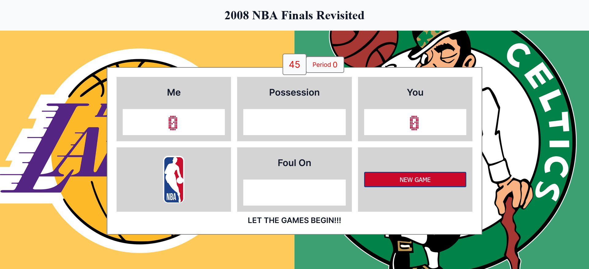
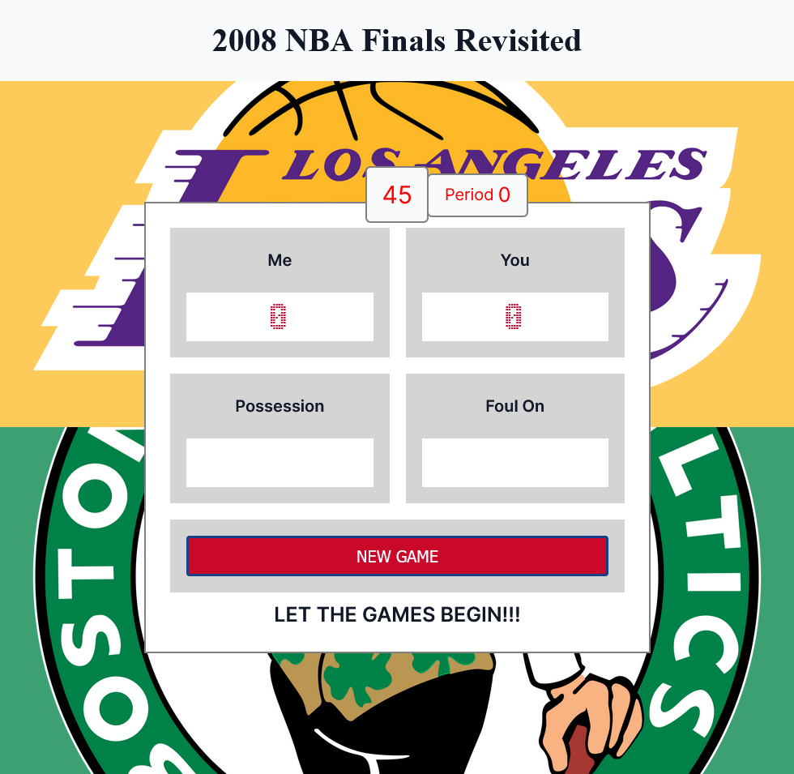
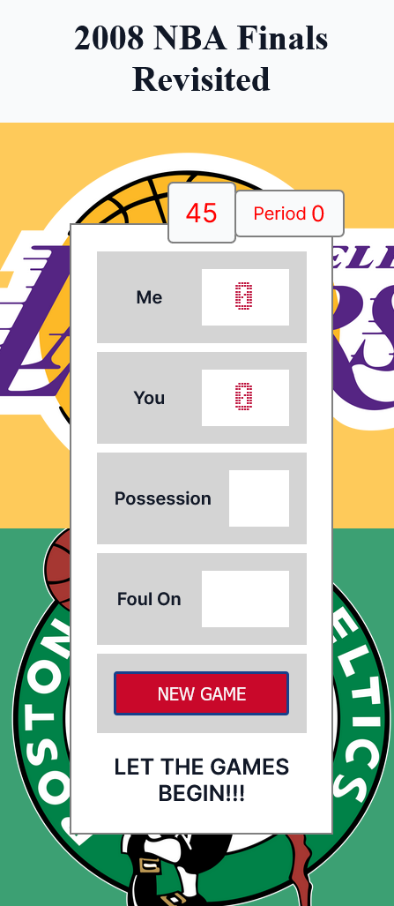
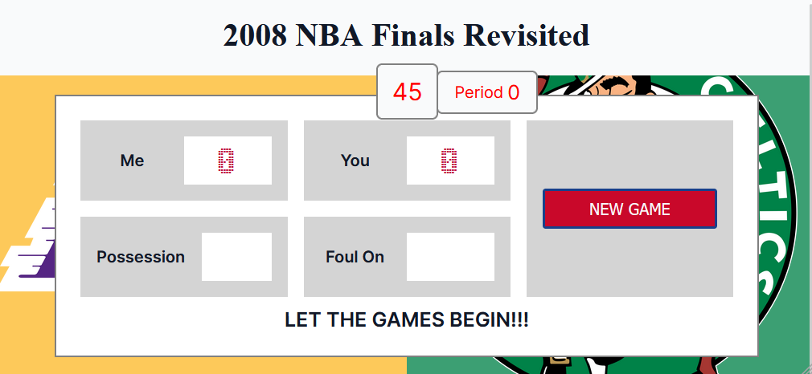

# 2008 NBA Finals Revisited

Okay. You made it! You're in the NBA Finals! Now it's time to beat your foe, the Los Angelos Lakers. If you look at the scoreboard, you will see two sides: ME and YOU. YOU are you and the Lakers are ME. This game will work how every basketball game works: you can dribble, shoot 3-pointers and 2-pointers, and defend against your opponent. But be careful—don't get too loose with the ball or get to reckless with your defense. If you do, you may commit a turnover or a foul, respectively. However, so might your opponents 😍. Oh oh, the games about to start! That's it, you've been debriefed—now go out there and get them Tiger!

## Table of contents

- [Overview](#overview)
  - [The challenge](#the-challenge)
  - [Screenshot](#screenshot)
  - [Links](#links)
- [My process](#my-process)
  - [Built with](#built-with)
  - [What I learned](#what-i-learned)
  - [Continued development](#continued-development)
  - [Useful resources](#useful-resources)
- [Author](#author)
- [Acknowledgments](#acknowledgments)

## Overview

This project started out as a simple basketball scoreboard with the only functionality being 3 score-incrementing buttons (+1-point, +2-points, and +3-points) for both the Home team and the Opponent. Wanted a greater challenge so turned the scoreboard into a replica of a real basketball game.

### The challenge

Add functionality to the buttons on the webpage. Make the scoreboard based off the Figma design. Design was changed to personalize. Make the personalization function like a real basketball game.

### Screenshot






### Links

Live Site: [https://2008-nba-finals-revisited.netlify.app/](https://2008-nba-finals-revisited.netlify.app/)

## My process

Design the HTML first and then the CSS. Initially designed desktop-first. Made the switch to mobile-first design when became more educated on how to make responsive sites.

### Built with

This game was built with HTML, CSS, and JS.

### What I learned

First: how to utilize flexbox and grid in the same webpage. Grid dictates the layout of the page, while flexbox determines the layout.

Secondly:
```css
@media (max-height: 480px) and (orientation: landscape) {}
```
When implementing the `landscape` media query, the `height` of the viewport is of interest (i.e. needs limitation), unlike `portrait` (regular) media queries which focus on the `width`. Also, when in the browser's responsive mode, once the `width` of the viewport becomes greater than the `height`, the browser automatically changes the orientation of the webpage to `landscape`.

### Continued development

- [ ] Make an instructions modal pop-up a couple seconds after opening the game to inform the user how to play the game.

### Useful resources

The Los Angelos Lakers, Boston Celtics, and NBA logos are from [freebiesubbly.com](https://freebiesupply.com/).<br>
The color palette for the gameplay buttons are from [SchemeColor](https://www.schemecolor.com/national-basketball-association-logo-colors.php).

## Author

Don't have any personal links other that this GitHub account.

## Acknowledgments

None